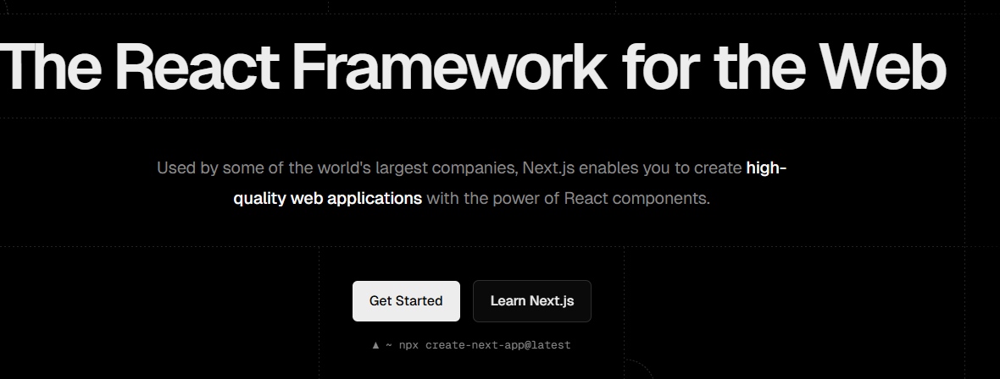
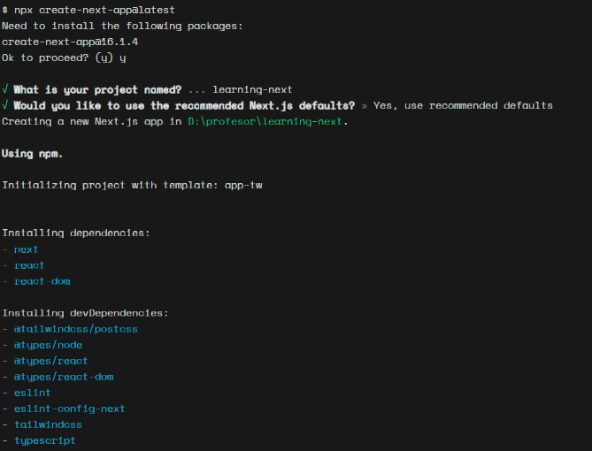
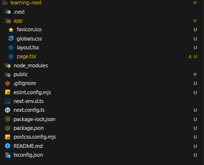
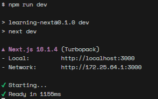
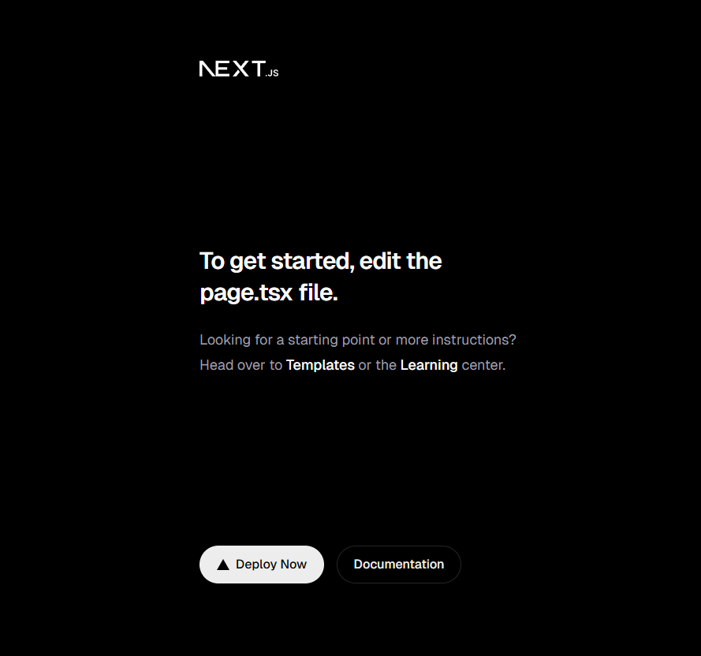
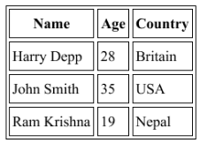
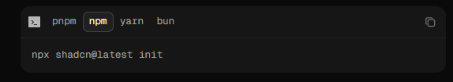
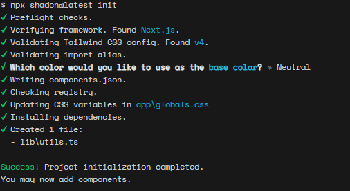
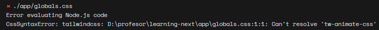
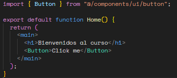

# Taller: "El Kit de Supervivencia Frontend"

Objetivo: Entender cómo se gestiona un proyecto moderno, la diferencia entre gestores de paquetes y cómo montar una interfaz profesional con componentes reutilizables.


### Instalación principal
NodeJS  https://nodejs.org/en  (Gestores multiversiones nvm, fnm, volta)  


Node es la base para la instalación, configuración, despliegue de frameworks y librerías modernas. 


## Inicio del taller


Para referencia sitio oficial de NextJS: https://nextjs.org/ 

Abrir la terminal en su IDE de preferencia, en este ejemplo se usa VSCode


Ejecute el siguiente comando  
```
npx create-next-app@latest
```

 Vamos a seguir las instrucciones para configurar la base del proyecto




navegue a la carpeta generada 
```
cd <nombre-proyecto>
```

deberían observar la siguiente estructura 



Vamos a enfocarnos en los siguientes elementos

| Nombre  | Función  |
|----------|----------|
| /app    | Va almacenar todo el código del proyecto  |
| /node_modules    | Contiene todos los elementos necesarios para ejecutar el proyecto   | 
| /public    | Contiene todos los recursos públicos  iconos, favicon, etc..  | 
| .gitignore   | indica cuales archivos no deben estar en un repositorio ej: variables de entorno, node_modules, etc..  | 
| next.config.ts | archivo que maneja configuraciones adicionales para next js|
| package.json | archivo que enumera scripts, dependencias, dependencias de desarrollo|
| readme.me| archivo normalmente usado para documentar el proyecto| 

# Cómo ejecutar el proyecto
Vamos abrir el archivo package.json
```
Localizar sección de scripts 

Ejecutar en la terminal (si la cerraron abrir desde los tabs superiores >terminal> new terminal)

npm run <script-name>

Para ambientes de desarrollo usamos el script de dev
```



Abran el enlace click o digitar en su navegador de preferencia




# Visita al código 

Para empezar vamos a ir al archivo page.tsx y vamos a dejar la función vacía. 
```
export default function Home() {
  return (
    <main>
      <h1>Bienvenidos al curso</h1>
    </main>
  );
}

```
NextJs hace hot reload cada vez que hagan cambios se ven reflejados en el momento de guardar. 

** Ventajas NextJS **
Puedes manejar las rutas simplemente creando carpetas con un archivo page.tsx

crear vista usuarios, replique la siguiente estructura 
```
 /app
    /users
        page.tsx // creen una nueva función teniendo en cuenta el código mostrado en el paso anterior
```

Ejercicio
```
crea la vista para dashboard, auth y profile.
```

Por defecto las page.tsx van a ser Server Side Rendered => Trae beneficios para SEO y posicionamiento.  Más adelante veremos client side
NextJS combina ambas. 

Ejercicio 

Cree esta tabla en la vista de users que creó 




## Te parece feo verdad?  vamos apoyarnos de nuevas librerías para tener mejores interfaces 

Librerías de ejemplo
* https://tailwindcss.com/
* https://ui.shadcn.com/
* https://chakra-ui.com/
* https://mui.com/

# Cómo instalar dependencias

El patrón de instalación es el siguiente:
```
npm install <dependencia>     
npm install -D <dependencia> //-D de desarrollo no se compila para desplegar a producción, menor peso en el bundle
```
En algunos casos surgen variaciones en el comando, cada librería te hará saber 

Para este ejemplo vamos a usar shadcn UI https://ui.shadcn.com/docs/installation/next



```
npx shadcn@latest init
```

** Adicional a npm van a encontrar en el mercado varios gestores de paquetes como yarn, pnpm 




El primer cambio notorio será el estilo de la letra que tenían ejecutando 



Te salió ese error? hora de práctica instalación 

```
Op1: https://tailwindcss.com/docs/installation/framework-guides/nextjs
Op2: Bruteforce elimina importación mencionada en globals.gicss 
```

Ahora podemos continuar instala el siguiente componente de shadcn UI
```
npx shadcn@latest add button
```

Si analizan el proyecto ahora existe una carpeta component/ui donde se almacenarán todos los componentes de shadcnUI
```
Desde la importación tienen disponible el tag
<Button> y deberá ser importado de esa carpeta mencionada
```

volvamos a nuestro page.tsx principal y vamos agregar el botón
```
import { Button } from "@/components/ui/button"; // primero se importa luego se puede usar dentro del tag

TIP: Para importar más rápido escribir el tag <Button> y usar ayuda del IDE para importar 

```



## Ejercicio 
```
Utilice 3 componentes que desee https://ui.shadcn.com/docs/components 
Para el ejercicio pueden estar en la misma página 
```


